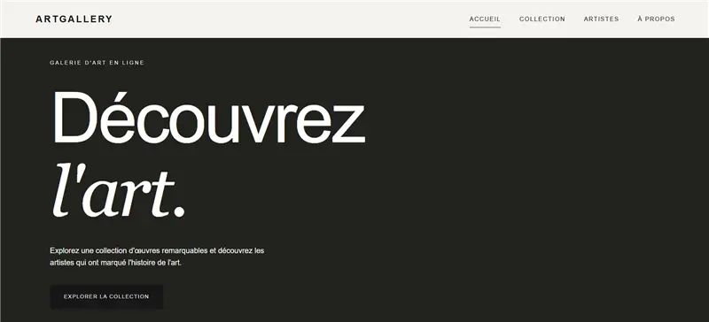

# Art Gallery

Art Gallery est un projet en groupe ayant pour finalité d'améliorer nos capacités à collaborer via GitHub.

## Installation

### Prérequis

- Un IDE (VS Code, PyCharm...)

### Commandes exactes

- Récupérer le repository via la commande :
  ```bash
  git clone https://github.com/Ranyaynov/art-gallery.git
  ```

- Installer les dépendances npm :
  ```bash
  cd backend
  npm install
  ```

## Dépendances

Nous utilisons une API sur les galeries d'art.

Voici la documentation de l'API en question :
https://api.artic.edu/docs

## Usage

Pour lancer le projet, il suffit d'effectuer la commande suivante à la racine du projet :

```bash
npm start
```

## Visuel




## Architecture

```text
art-gallery/
│
├── backend/
│   ├── controller/          # Logique des différentes routes
│   ├── router/              # Définition des routes de l'API
│   ├── .gitignore           # Fichiers ignorés par Git pour le backend
│   ├── index.js             # Point d'entrée du serveur backend
│   ├── package-lock.json    # Versions exactes des dépendances
│   └── package.json         # Dépendances et scripts du backend
│
├── docs/                    # Documentation du projet
│
├── frontend/
│   ├── css/                 # Fichiers de style CSS
│   ├── js/                  # Scripts JavaScript
│   └── pages/               # Pages HTML du site
│
├── .gitignore               # Fichiers et dossiers ignorés par Git
├── contributing.md          # Règles de contribution au projet
└── README.md                # Documentation principale du projet
```

## Support

*Le projet n'est pas supporté.*